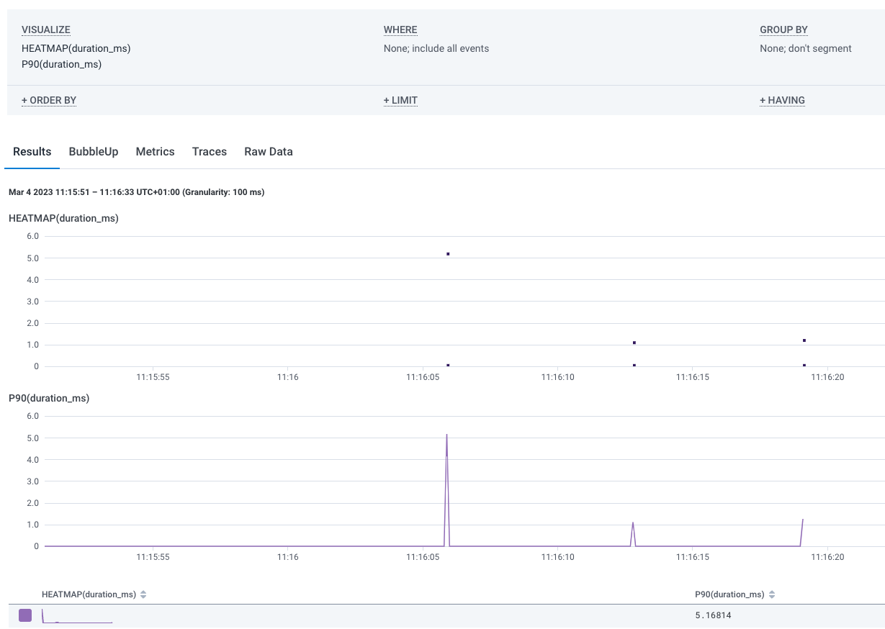

# Week 2 — Distributed Tracing

## Honeycomb setup
Honeycomb is an observability tool that allow you gain insight into performance of your solution.
Honeycomb offers free-tier pricing option. To setup a Honeycomb account:
- Go to ***honeycomb.io***
- click on the **Pricing**, the **Get Started** to create a free account.
- follow the steps in this [Honeycomb](https://www.youtube.com/watch?v=2GD9xCzRId4&list=PLBfufR7vyJJ7k25byhRXJldB5AiwgNnWv&index=31) to create environment and copy your API-Key.
- Run the command, `export HONEYCOMB_API_KEY="wWxmjac8EHWONJnQE6xIxD"` to set it as environment variable
- Run, `gp env HONEYCOMB_API_KEY="wWxmjac8EHWONJnQE6xIxD"` to allow gitpod to grab it when next it loaded.
- Install these Honeycomb packages by running:
    ```
        pip install opentelemetry-api \
        opentelemetry-sdk \
        opentelemetry-exporter-otlp-proto-http \
        opentelemetry-instrumentation-flask \
        opentelemetry-instrumentation-requests
    ```
- Next, add the following to the **app.py** file
    ```
    from opentelemetry import trace
    from opentelemetry.instrumentation.flask import FlaskInstrumentor
    from opentelemetry.instrumentation.requests import RequestsInstrumentor
    from opentelemetry.exporter.otlp.proto.http.trace_exporter import OTLPSpanExporter
    from opentelemetry.sdk.trace import TracerProvider
    from opentelemetry.sdk.trace.export import BatchSpanProcessor
    ```
    ```
        # Initialize tracing and an exporter that can send data to Honeycomb
        provider = TracerProvider()
        processor = BatchSpanProcessor(OTLPSpanExporter())
        provider.add_span_processor(processor)
        trace.set_tracer_provider(provider)
        tracer = trace.get_tracer(__name__)
    ```
    ```
        # Initialize automatic instrumentation with Flask
        app = Flask(__name__)
        FlaskInstrumentor().instrument_app(app)
        RequestsInstrumentor().instrument()
    ```
- Configure OpenTelemetry, OTEL to send events to Honeycomb by setting some env variables to the docker-compose file. 
```
    OTEL_SERVICE_NAME: "your-service-name"
    OTEL_EXPORTER_OTLP_ENDPOINT: "https://api.honeycomb.io"
    OTEL_EXPORTER_OTLP_HEADERS: "x-honeycomb-team=${HONEYCOMB_API_KEY}"
```
- Next, go to the 'frontend-react-js' directory and run `npm install`
- run `cd ..` and then run `docker-compose up`
- after the build completes, go to the **PORT** tab amd open the ports for public accessibility. To automate this:
- add the following to the *gitpod.yml* file
```
    ports:
        - name: frontend
          port: 3000
          onOpen: open-browser
          visibility: public
        - name: backend
          port:4567
          visibility: public
        - name: xray-daemon
          port: 2000
          visibility: public
```
- Now run `docker-compose up`
- After build the ports will be made public and the frontend will automatically open on a new tab

#challeng
I loaded a new github workspace and the FRONTEND_URL and BACKEND_URL environment variables were not set.
As a result I was getting the error message, '3000 port not found' 
It took me a while to debug this, but in the end, I got it sorted out.
docker compose doesn't find the environment variables when I write-click on the file and click `compose up`
What I did instead was to run `docker compose up` from the terminal that I exported the env variables from.

## Acquiring a Tracer.
To put span around home-activities endpoint to show return of hard-coded data to show in our trace story. 
- open **'home_activities.py'**
- go to this [honeycomb python doc](https://docs.honeycomb.io/getting-data-in/opentelemetry/python/)
- scroll down and copy the code and paste in the 'home_activities.py' file.
```
    from opentelemetry import trace
    tracer = trace.get_tracer("home.activities")

```
- Then copy `with tracer.start_as_current_span("home-activities-mock-data"):` into the **def run():** block.
- Add `span = trace.get_current_span()` below the above code and make sure the block is well indented.
- Add attributes to the span:
    - add the line `span.set_attribute("app.result_length", len(results))` at the buttom of **home_activities.py**, just before the return line.



